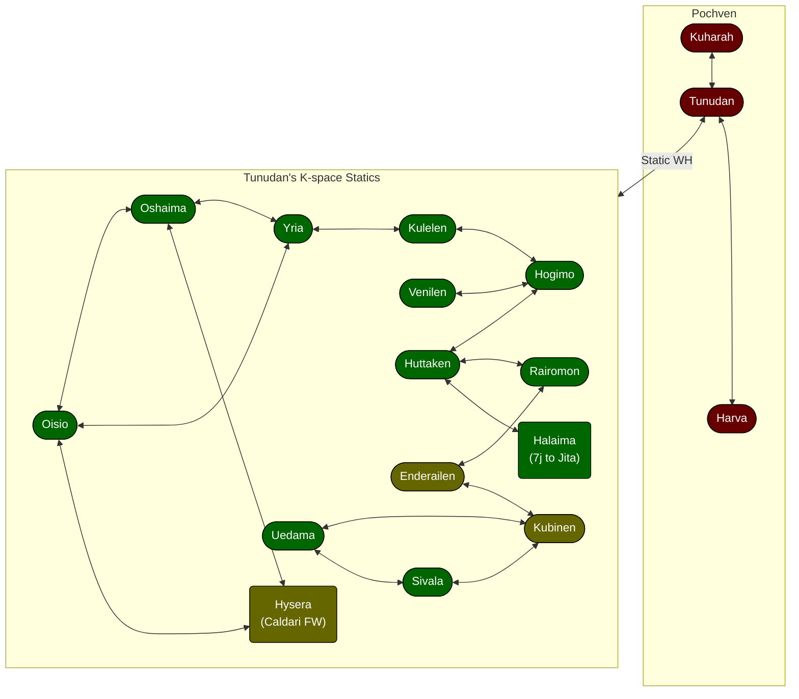

1. TOC
{:toc}
### Pochven
Below is a map of Pochven.

Below is a list of Trig space systems with maps of their static entry systems.
 
### Ichoriya

### Tunudan

```mermaid
graph TD
    subgraph pochven [Pochven]
        Tunudan([Tunudan]) <--> Harva([Harva])
        Kuharah([Kuharah]) <--> Tunudan
        Tunudan:::nullsec
        Harva:::nullsec
        Kuharah:::nullsec
    end
    subgraph statics [Tunudan's K-space Statics]
        Oisio([Oisio]):::highsec
        Oshaima([Oshaima]):::highsec
        Yria([Yria]):::highsec
        Kulelen([Kulelen]):::highsec
        Venilen([Venilen]):::highsec
        Hogimo([Hogimo]):::highsec
        Huttaken([Huttaken]):::highsec
        Rairomon([Rairomon]):::highsec
        Enderailen([Enderailen]):::lowsec
        Kubinen([Kubinen]):::lowsec
        Uedama([Uedama]):::highsec
        Sivala([Sivala]):::highsec
        Halaima("Halaima
        (7j to Jita)"):::highsec
        Hysera("Hysera
        (Caldari FW)"):::lowsec
        Oisio <--> Oshaima
        Oisio & Oshaima <--> Yria
        Yria <--> Kulelen
        Kulelen & Venilen & Huttaken <--> Hogimo
        Huttaken & Enderailen <--> Rairomon
        Uedama & Sivala & Enderailen <--> Kubinen
        Uedama <--> Sivala
        Huttaken <--> Halaima
        Oisio & Oshaima <--> Hysera
    end
    Tunudan <-->|Static WH| statics
    classDef nullsec fill:#600,stroke:#000,color:#fff
    classDef lowsec fill:#660,stroke:#000,color:#fff
    classDef highsec fill:#060,stroke:#000,color:#fff
```
